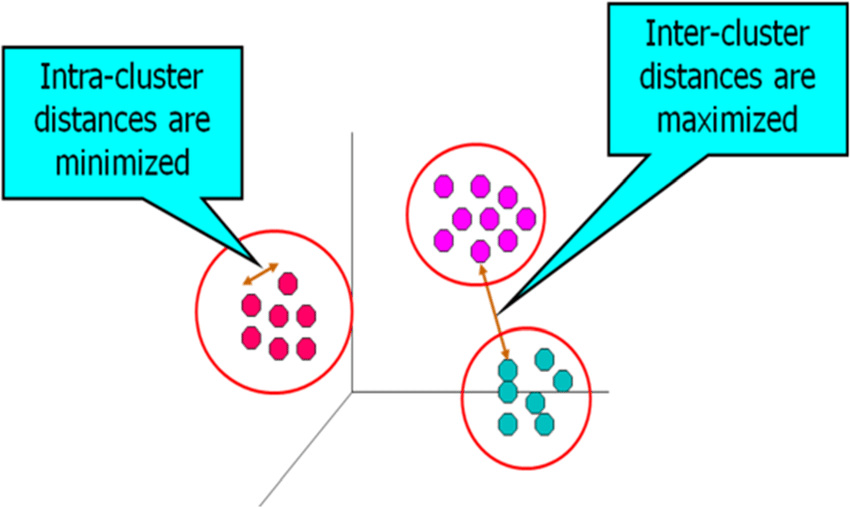

```{r setup, include=FALSE}
knitr::opts_chunk$set(echo = TRUE)
library(factoextra)
library(leaflet)
library(dplyr)
```


# Data Mining et Clustering : définitions

L'exploration des données (***Data Mining***) est le processus qui conduit à l'extraction d'informations et de modèles (*patterns*) dans les données. 

Il existe plusieurs techniques pour réaliser un data mining. Parmi ces techniques, il y a le ***Clustering*** (Segmentation en français) qui est une technique de Machine Learning non-supervisé.

La technique de Clustering est le processus de regroupement d'un ensemble de points de données en plusieurs groupes ou clusters afin que les éléments d'un cluster aient une grande similitude, mais soient très différents des éléments d'autres clusters. En effet, les clusters sont des ensembles de points d'un ensemble multidimensionnel de données tels qu'ils minimisent la distance entre les membres d'un même cluster (distance intra-cluster) et maximise la distance entre les membres de différents clusters.




A travers ce cours, vous apprendrez deux techniques de clustering :

* clustering avec l'algorithme des K-moyennes (***K-means***) ;

* clustering hiérarchique.


# Clustering avec k-means

L'algorithme K-means parcourt de manière itérative les trois étapes principales suivantes :

1. Spécifiez le nombre de clusters, k. Attribuez leurs emplacements initiaux au hasard ou dans des emplacements spécifiques.

2. L'algorithme attribue toutes les observations du jeu de données au cluster le plus proche.

3. L'emplacement de chaque centre de cluster (centroïde) est recalculé en calculant la moyenne de tous les membres du cluster dans toutes les dimensions.

Répétez les étapes 2 et 3 (réassignation des points aux clusters, puis repositionnement des centres de cluster) jusqu'à ce qu'il n'y ait plus de mouvement des clusters.

Pour cette technique, vous devez vous-mêmes spécifier le nombre de clusters (*k*) pouur votre analyse. Parfois, vous pouvez avoir une idée du nombre de clusters soit à cause de votre expertise du Business ou soit à cause de l'existence d'analyses de rentabilisation où les objectifs déterminent intrinsèquement le nombre de clusters en fonction des ressources disponibles ou d'autres réalités du marché. 

Plusieurs méthodes comme la méthode du coude (*elbow method*) et la méthode de la silhouette moyenne (*average silhouette*) permettent de déterminer le nombre optimal de clusters.

- Avec la **méthode du coude**, le meilleur k est celui à partir duquel on observe plus d’amélioration sensible de la qualité de la segmentation (*clustering*) au fur et à mesure que le k augmente (k = 1 à 10 par exemple). Pour cette valeur k, on observera une coude au niveau de la courbe donnant l'inertie en fonction du nombre de clusters (k).

- La **méthode de la silhouette moyenne** mesure à quel point chaque individu (observation) est intégré dans son groupe. Une largeur de silhouette moyenne élevée indique un bon cluster. La méthode de la silhouette moyenne calcule la silhouette moyenne des observations pour différentes valeurs de k. Le nombre optimal de groupes k est celui qui maximise la silhouette moyenne sur une plage de valeurs possibles pour k.

Afin d'illustrer ces deux méthodes, nous utiliserons le jeu de données iris.

## Détermination du nombre de clusters

Nous allons segmenter les données du jeu de données *iris* en supposant que les données soient non-étiquetées.

### Normalisation des données

L'algorithme des K-means utilise la distance entre les points. Donc, il est absolument nécessaire que les données soient à la même échelle afin qu'il n'y ait pas de variables qui aient beaucoup plus de poids que d'autres. Vous pouvez soit normaliser les données (répartir les valeurs entre 0 et 1) soient les standardiser (moyenne = 0 et écart-type = 1).

```{r}
# Données iris

head(iris)

# Suppression de la colonne 'Species'

iris$Species <- NULL

# Normalisation des données

normalize <- function(x) {
    return ((x - min(x)) / (max(x) - min(x)))
}

iris_norm <- normalize(iris)

# Statistiques des données normalisées

summary(iris_norm)

# Standardisation des données

iris_stand <- as.data.frame(scale(iris))

# Statistiques des données standardisées

summary(iris_stand)
```


### Méthode du coude pour la détermination du meilleur nombre de clusters

La fonction [fviz_nbclust](https://www.rdocumentation.org/packages/factoextra/versions/1.0.7/topics/fviz_nbclust) du package [factoextra](https://www.rdocumentation.org/packages/factoextra/versions/1.0.7) permet de déterminer et de visualiser le nombre optimal de clusters pour un ensemble de données.


```{r}
#Méthode du coude pour déterminer le meilleur nombre de clusters

elbow_method <- fviz_nbclust(iris_stand, FUNcluster = kmeans, method = "wss")

elbow_method
```


La méthode du coude suggère 3 clusters pour les données. 

**Au niveau de l'application, vous devez donner la possibilité à l'utilisateur de choisir entre les données normalisées et celles standardisées**.

Voyons à présent le nombre de clusters suggéré par la méthode de la silhouette moyenne

### Méthode de la silhouette moyenne pour la détermination du meilleur nombre de clusters


```{r}
#Méthode de la silhouette moyenne

silhouette_method <- fviz_nbclust(iris_stand, FUNcluster = kmeans, method = "silhouette")

silhouette_method
```


Deux clusters ont été suggérés par la méthode de la silhouette moyenne.

### Exécution et Visualisation des résultats de la segmentation


```{r}
set.seed(123)

#Exécution de l'algorithme k-means avec k = 3

model <- kmeans(iris_stand, centers = 3, nstart = 20)

# Visualisation des résultats

plot(iris[, c("Sepal.Width", "Petal.Length")], 
     col = as.factor(model$cluster), 
     pch = 20, cex = 3)
```

## Cas d'étude : Identification des emplacements des kiosques de service à la clientèle de la société Bike Sharing LLC

Bike Sharing LLC continue de croître chaque année. La direction souhaite accroître l'interaction avec les clients en améliorant le modèle d'affaires. Ils ont alloué un budget qui prend en charge la construction de jusqu'à trois petits kiosques de service à la clientèle, stratégiquement situés dans la région métropolitaine de Washington, DC.

L'idée est d'embaucher des personnes pour travailler dans ces kiosques tout au long de la journée. Les kiosques fourniraient un petit nombre de produits tels que des bandes pour protéger les pantalons des cyclistes, des cartes de la ville, des bouteilles d'eau, de petites collations et des articles de fantaisie. Les représentants dans les kiosques peuvent également aider les utilisateurs occasionnels à se convertir en utilisateurs enregistrés en répondant aux questions et en offrant une expérience plus personnalisée.

**Votre travail consiste à recommander le nombre et l'emplacement des kiosques**. 

Les données contiennent les emplacements des 244 stations de partage de vélos réparties dans la ville. Les données de localisation sont en coordonnées de latitude et de longitude. [Trouver la vraie source des données]

La direction a demandé à l'équipe d'intelligence d'affaires de présenter ses résultats sous forme d'analyse de rentabilisation, non seulement où placer les kiosques, mais en comprenant pourquoi. Leur objectif sous-jacent est de placer les kiosques de service à la clientèle dans les zones de la ville qui ont des concentrations plus denses de stations de vélo. Ils aimeraient également minimiser la distance totale entre les stations de vélos et le kiosque le plus proche.

Comme vous pouvez le voir, vous devez trouver un juste équilibre dans ce problème. Du point de vue de la distance, plus de kiosques les rendraient plus accessibles aux cyclistes. Cela augmenterait également les coûts de construction, d'entretien et de main-d'œuvre. Cependant, en avoir trop peu les éloignerait des stations de vélo et pourrait réduire l'effet que cette initiative de gestion vise à avoir. Lorsque vous commencez à étudier ce cas d'utilisation, tenez compte de ces limitations, ainsi que des idées d'expansion future si cette initiative fonctionne.

### Imporation et analyse exploratoire des données

```{r}
# Importation des données
stations <- read.csv("data/bike_station_locations.csv") 
head(stations)

# Résumé statistique
summary(stations) 
```


Il n'y a pas de valeurs manquantes et il n'y a rien de particulièrement sophistiqué dans ces données car il s'agit simplement d'une liste de stations de vélos et de leurs géolocalisations.

```{r}
# Nuage de points
ggplot(stations, aes(longitude, latitude)) +
  geom_point()
```


```{r}
# Affichage des stations de vélos sur une carte
bike <- makeIcon("data/bike.png", iconWidth = 20, iconHeight = 20) 

leaflet() %>% 
     addTiles() %>% 
     addMarkers(data = stations, ~longitude, ~latitude, icon = ~bike) 
```


Vous pouvez voir le contour général de Washington, D.C. dans le panneau le plus à droite. Il semble que Bike Sharing LLC ait une bonne couverture de stations de vélos dans toute la ville. Cette carte ne montre pas clairement un nombre optimal de clusters. Il serait difficile de placer deux ou trois kiosques en utilisant uniquement l'inspection visuelle. Nous allons donc utiliser l'algorithme k-means.

### Identification des kiosques avec K-means

Utilisons la technique du coude et celle de la silhouette pour déterminer le nombre de clusters :

```{r}
# Méthode du coude
fviz_nbclust(scale(stations), FUNcluster = kmeans, method = "wss")
```


```{r}
# Méthode de la silhouette moyenne

fviz_nbclust(scale(stations), FUNcluster = kmeans, method = "silhouette")
```


vous allez créer deux objets R pour contenir les résultats de deux modèles k-means, un avec deux clusters et un autre avec trois clusters. Les contraintes du problème métier conduisent l'analyse à examiner les options de deux ou trois kiosques de service client :


```{r}
two <- kmeans(stations, 2) 
two
three <- kmeans(stations, 3) 
three
```

Commentons ces résultats. Par exemple, pour le modèle *three* :

* Les tailles respectives des 3 clusters sont : 94, 57 et 93 ;

* **Cluster means** fournit la localisation du centre de chaque cluster

```{r}
# Centroïdes
three$centers
```

* **Clustering vector** attribue à chaque point de données (ici chaque station de vélo) son cluster (entre 1, 2 et 3) ;

* **Within cluster sum of squares by cluster** 

```{r}
# Visualisation du résultat du modèle à 3 clusters
ggplot(stations, aes(longitude, latitude, col = as.factor(three$cluster))) +
  geom_point() +
  labs(colour = "Cluster") +
  geom_point(
    data = data.frame(three$centers), 
    aes(longitude, latitude), 
    col = "black", shape = 4, size = 3
  )
```

Il fournit la somme de l'erreur carrée dans chaque cluster, ainsi qu'un pourcentage indiquant dans quelle mesure le modèle a pris en compte l'erreur dans le modèle. le modèle *three* explique 65,7% de l'erreur.


```{r}
# Visualisation du résultat du modèle à 2 clusters
ggplot(stations, aes(longitude, latitude, col = as.factor(two$cluster))) +
  geom_point() +
  labs(colour = "Cluster") +
  geom_point(
    data = data.frame(two$centers), 
    aes(longitude, latitude), 
    col = "black", shape = 4, size = 3
  )
```

Créons une fonction permettant de visualiser les résulats du modèle K-means en fonction du nombre de cluster k :


```{r}
kmeans_viz <- function(k) {
  model <- kmeans(stations, centers = k)
  percentage_of_error_explained <- round(
    model$betweenss/model$totss * 100, 1
  )
  p <- ggplot(
    stations, 
    aes(
      longitude, latitude, 
      col = as.factor(model$cluster)
    )
  ) +
    geom_point() +
    labs(colour = "Cluster") +
    geom_point(
      data = data.frame(model$centers), 
      aes(longitude, latitude), 
      col = "black", shape = 4, size = 3
    ) +
    ggtitle(
      paste(
        "Sites pour ", k, 
        " kiosques. % d'erreur expliquée par le modèle : ", 
        percentage_of_error_explained, " %"
      )
    )
  
  
  return(plotly::ggplotly(p))
}

```


```{r}
# Visualisation du résultat du modèle à 4 clusters

kmeans_viz(4)
```


```{r}
# for (i in 2:10) {
#   print(kmeans_viz(i))
# }
lapply(2:10, kmeans_viz)
```


```{r}

```


# Clustering hiérarchique

Les techniques de clustering hiérarchique abordent l'analyse un peu différemment du clustering k-means. Au lieu de travailler avec un nombre prédéterminé de centres et d'itérer pour trouver l'appartenance, les techniques hiérarchiques associent ou divisent continuellement les données en clusters en fonction de la similarité (distance). Il existe deux approches différentes :

**Clustering par division** : cela commence par toutes les données d'un seul cluster, puis le divise ainsi que tous les clusters suivants jusqu'à ce que chaque point de données soit son propre cluster individuel

**Clustering agglomératif** : cela commence avec chaque point de données individuel et les associe dans une hiérarchie jusqu'à ce qu'il n'y ait qu'un seul cluster

Dans cette section, vous apprendrez et utiliserez le clustering hiérarchique agglomératif. C'est un peu plus rapide que le clustering avec division, mais ils peuvent tous les deux fonctionner lentement avec de très grands ensembles de données. L'un des avantages des approches hiérarchiques est qu'elles ne vous obligent pas à spécifier le nombre de clusters à l'avance. Vous pouvez exécuter le modèle et élaguer l'arborescence hiérarchique au nombre de clusters que vous choisissez après avoir vu l'intégralité du modèle. Il existe des techniques d'évaluation pour vous aider à choisir le nombre de clusters dans votre modèle final. Vous apprendrez les techniques d'évaluation dans cette section.

## Cas d'étude : Segmentation de la clientèle de la socité Bike Sharing LLC pour un marketing ciblé

Le succès d’une entreprise dépend largement de sa connaissance du comportement de sa clientèle. Dans la plupart des cas, il est impossible de connaître chaque client de façon individuelle. Heureusement, il existe des techniques (*Clustering*) permettant de classer tous les clients en groupes en fonction de similitudes identifiées (caractéristiques communes) : segmentation de la clientèle.

Vous avez fait un bon travail sur le projet de création des kiosques. La nouvelle circule et le groupe marketing souhaite que vous l'aidiez à définir des segments de clientèle et à cibler des campagnes publicitaires. L'achalandage des vélos en libre-service a augmenté de plus de 65 %, passant de 1 221 270 utilisations en 2011 à 2 028 912 utilisations en 2012, ce qui représente plus de 3,2 millions de vélos en libre-service.

Vous avez reçu les données d'âge et de revenu de plus de 8 000 clients existants.

Votre travail consiste à utiliser vos compétences pour inspecter et explorer les données. Ensuite, vous créerez divers modèles de clustering hiérarchiques et les évaluerez pour déterminer le nombre et les caractéristiques des segments de clientèle. Au fur et à mesure que vous résolvez le problème, observez le nombre de décisions analytiques que vous prenez, toutes affectant le produit final. Cela vous demandera d'utiliser vos compétences analytiques et votre sens des affaires, en mélangeant la science et l'art.

### Importation et analyse exploratoire des données


```{r}
# Importation
market <- read.csv("data/age_income_data.csv") 
head(market)

# Structure de la dataframe
str(market) 

# résumé statistique
summary(market)
```

```{r}
ggplot(market, aes(bin, age, col = bin)) +
  geom_boxplot()

ggplot(market, aes(bin, income, col = bin)) +
  geom_boxplot()

ggplot(
  market,
  aes(age, income, col = bin)
) +
  geom_jitter()
```

```{r}
# Normalisation des données
market$age_scale <- as.numeric(scale(market$age)) 
market$inc_scale <- as.numeric(scale(market$income)) 

head(market)
```


### Exécution de la du clustering hiérarchique agglomératif
```{r}
set.seed(456) 
hc_mod <- hclust(dist(market[ ,4:5]), method = "ward.D2") 
```


```{r}
dend <- as.dendrogram(hc_mod) 
library(dendextend) 
dend_six_color <- color_branches(dend, k = 6) 
plot(dend_six_color, leaflab = "none", horiz = TRUE,  
     main = "Age and Income Dendrogram", xlab = "Height") 
abline(v = 37.5, lty = 'dashed', col = 'blue') 
```

[Voir mes notes sur clustering hiérarchique. Les notes que j'avais prises pour le projet du petit frère de Marving]


pour voir l'application : http://jgendron.github.io/


